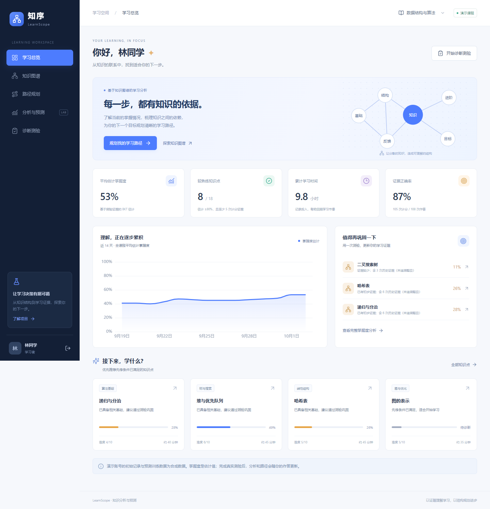
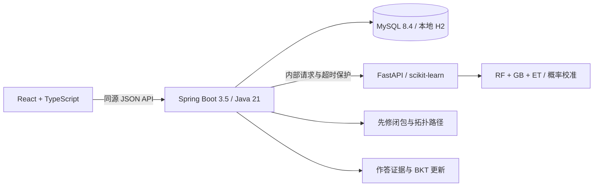

# 知序 LearnScope

基于知识图谱的在线学习知识分析与预测系统。依据《在线学习服务中知识分析预测系统设计与实现》独立复现核心方案，并改进路径约束、预测评估和服务端鉴权。

项目聚焦 **知识图谱 → 学习证据 → 掌握度分析 → 个性化路径 → 测验反馈**。不包含笔记、计划、成就等外围功能。



## 可以实际体验的功能

- 交互知识图谱：18 个数据结构与算法知识点，32 条先修、关联和组成关系；支持拖动、缩放、筛选和详情查看。
- 掌握度分析：BKT 状态更新与遗忘参考机制；同题 24 小时内重做只记练习，区分累计作答与计分证据，避免重复刷题虚增状态。
- 个性化路径：计算目标先修闭包，用拓扑排序保证依赖顺序；只在就绪节点之间按难度与重要性排序。预算不足时保留连续前缀。
- 情景预测：校准后的随机森林、梯度提升和极端随机树集成；成对比较额外学习与 0 分钟基准的答对概率，如实显示差值与模型局限。
- 可检查的评估：显示独立学习者测试、时间向后验证、逻辑回归基线、AUC、Brier、RMSE 和 ECE。
- 测验反馈：54 道重新编写的单选题，服务端判分、结构化解析、归属验证和重复提交幂等；结果同步影响分析与路径。
- 知识维护：教师创建和编辑知识点、增删关系；事务内检查循环依赖，使用版本号拒绝过期内容更新。
- 运行与数据：学习记录持久化、个人证据导出、预测服务超时回退、桌面与移动端适配。

## 技术结构



`web/` 是前端，`server/` 是业务服务，`predictor/` 是预测与训练服务。采用 HTTP 接口保留论文的多语言分层结构。本地 H2 只用于简化体验，容器配置使用 MySQL。

## Windows 本地启动

需要 Python 3.12、Node.js 22.12+ 或 24，以及 pnpm。脚本在 Codex 桌面环境中会优先使用已有运行时；其他电脑使用 PATH 中的安装。Java 21 与 Maven 会下载到项目的 `.tools/`，不修改系统安装。

在项目根目录执行：

```powershell
.\scripts\setup-local.ps1
.\scripts\start-local.ps1 -Build
```

打开 **http://127.0.0.1:5173**。停止服务：

```powershell
.\scripts\stop-local.ps1
```

日志与启动进程记录位于 `.local/`。脚本先检查端口，再构建启动，只有前端、后端和已加载模型的预测服务全部就绪才报告成功。如果端口 5173、8080 或 8001 已被占用，启动脚本会指出端口；启动失败会回收本次创建的进程。

### 演示账号

| 账号 | 角色 | 密码 |
| --- | --- | --- |
| `student` | 学习者 | `LearnScope2026!` |
| `teacher` | 教师 | `LearnScope2026!` |
| `admin` | 管理员 | `LearnScope2026!` |

演示模式提供快捷入口，初始学习者记录由固定随机种子生成。注册新账号后没有历史记录，适合观察冷启动与真实作答变化。

### 手动启动与其他操作系统

```bash
python -m venv .venv
# 激活虚拟环境后
pip install -r predictor/requirements.txt
python predictor/train.py

# 三个终端分别执行；后端建议在项目根目录启动
mvn -f server/pom.xml package
java -jar server/target/learnscope-server-1.0.0.jar

cd predictor
uvicorn app:app --host 127.0.0.1 --port 8001

cd web
pnpm install --frozen-lockfile
pnpm dev
```

学习数据保存在后端启动目录的 `data/`。不要同时运行多个使用同一 H2 文件的服务实例。

## Docker 与 MySQL

```bash
python scripts/create_env.py
docker compose up --build -d
```

打开 **http://localhost:8090**。配置默认绑定本机回环地址；数据库与预测服务只在内部网络开放。`create_env.py` 生成独立随机密钥，不覆盖已有 `.env`，密钥文件已被 Git 忽略。

正式部署时使用 HTTPS 反向代理，并将 `APP_ORIGIN` 设为准确的访问来源、`SECURE_COOKIE=true`、`DEMO_MODE=false`。全新数据库首次启动会使用 `BOOTSTRAP_ADMIN_PASSWORD` 创建管理员；演示账号只会在全新数据库的演示模式下初始化。切换模式不会删除已有账号与数据。

修改公开访问方式时调整 `compose.yaml` 的端口绑定或接入已有反向代理。不要把共享演示教师账号用于真实教学数据。

**验证范围：** 当前交付已验证 Windows 本地 H2、Java/Python 服务和浏览器流程。本环境没有 Docker 或 MySQL，容器与 MySQL 配置已提供，但未在本机执行容器验证。

## 验证命令

```bash
mvn -f server/pom.xml test

cd predictor
python train.py
python -m unittest test_engine -v

cd ../web
pnpm build
# 启动三个服务后；Windows 默认使用已安装的 Edge
node ../scripts/e2e.mjs
```

浏览器验证需要 `web` 的开发依赖。其他系统可用 `BROWSER_CHANNEL=chrome` 选择安装的 Chrome。脚本使用新的无头浏览器上下文，不接触个人浏览器资料，保存截图到 `docs/screenshots/`；会创建 `e2e_` 前缀的独立学习者账号，保留两次诊断的测试记录。

当前检查包含 21 项 Java 测试、5 项 Python 测试，以及浏览器完整流程。随机 DAG 测试检查 50 组图的依赖顺序与唯一性，新增重复证据、旧数据兼容与成对预测回退的回归检查。详见 [验证记录](docs/validation.md)。

## 作品集材料

- [方法与改进说明](docs/methods.md)：算法约束、估计语义、数据切分与模型局限。
- [复现对应关系](docs/reproduction.md)：论文各核心章节对应实现与明确省略范围。
- [接口说明](docs/api.md)：核心 API、认证、错误与幂等行为。
- [演示讲解稿](docs/demo.md)：约 3 分钟展示流程与简历描述。
- [模型实测报告](predictor/artifacts/metrics.json)：由训练脚本生成的评估记录。
- [页面截图](docs/screenshots/)：图谱、路径、预测、测验与移动端。

## 预测结果的含义

论文没有提供原始源码、训练集或可验证模型，因此本项目没有继承论文的 RMSE、R² 或并发表现。当前训练集为合成数据，回答标签通过概率采样生成。合成测试只能验证工程流程和评估方法。

当前掌握度是 BKT 的潜在状态估计；预测输出是“下一次答对概率”。两者不等于真实知识掌握标签。时间衰减参数和路径时长都是演示假设；模型间差异也不是统计置信区间。真实教学效果需要真实数据和外部验证。

参考论文：许圣昊，2025，《在线学习服务中知识分析预测系统设计与实现》。正文、原截图、学号及原文件未进入可发布项目；课程内容与题库由本项目重新编写。

技术文档：[Spring Boot](https://docs.spring.io/spring-boot/3.5/system-requirements.html)、[Vite](https://vite.dev/guide/)、[scikit-learn 交叉验证](https://scikit-learn.org/stable/modules/cross_validation.html)。
